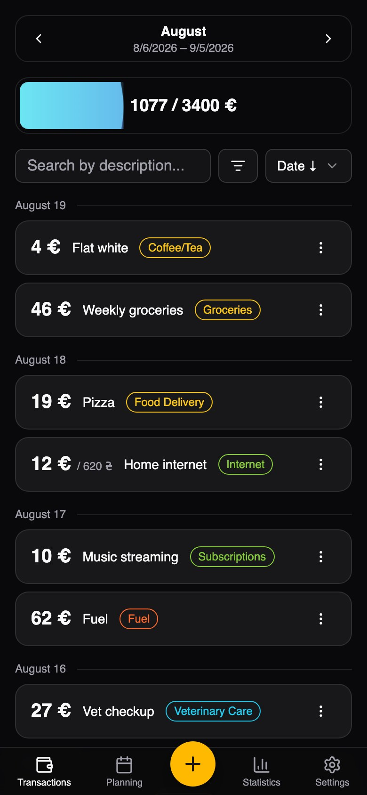
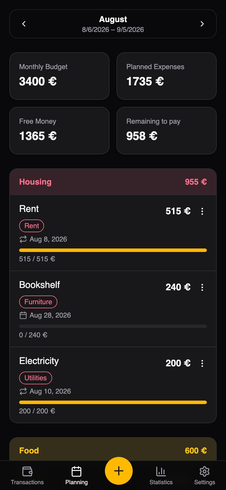
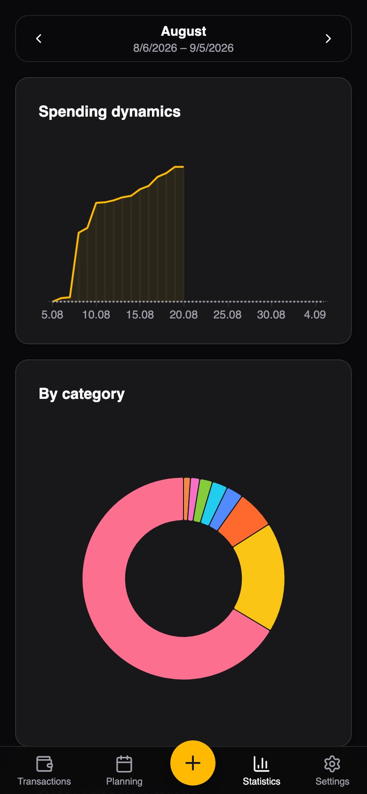

# Koshtorys — Expense Tracker

A mobile-first PWA for tracking **spending only** — no income, no accounts, no double-entry. Log what you spend, plan the month ahead, and see where the money actually went. Multi-currency, bilingual (Ukrainian / English), installable on a phone.

**Live demo → [koshtorys.karkleo.com](https://koshtorys.karkleo.com/)**

> The demo runs against a test backend. Treat anything you put there as throwaway data.

## Screenshots

| Transactions | Planning | Statistics |
|---|---|---|
|  |  |  |

## What makes it different

**The financial month.** Most trackers assume a month starts on the 1st. Here you pick the day — usually payday — and the month runs from that day to the same day of the next calendar month minus one. A month starting on the 25th is still labelled by the calendar month that holds most of its days: if the start day is `< 15` the index matches the calendar month, if it is `>= 15` it shifts forward by one. Every screen, chart and plan is scoped to that period rather than to the calendar.

**Two kinds of plans.** A *one-off* plan is a single intended purchase ("a new cabinet") that can later be linked to the real transaction that fulfilled it. A *dynamic* plan is a monthly ceiling for a category ("food", "fuel"). They compute "spent" differently: a one-off shows its linked transaction, a dynamic one sums every transaction in its category **except** those already claimed by a one-off. Either kind can be marked recurring and will be suggested again next month.

**A budget, not a balance.** The budget is what you intend to spend in a month — a salary, or a self-imposed limit — and the whole UI reads as *how much of it is left*, not *how much you have*.

## Stack

Vue 3 (Composition API) + TypeScript · Vite · Pinia · Vue Router · Reka UI via shadcn-vue · Tailwind CSS 4 · ECharts · vue-i18n · Yup · vite-plugin-pwa (Workbox) · Vitest + Playwright + Storybook.

## Running locally

```bash
npm install
cp .env.example .env      # VITE_API_ENDPOINT — where the REST API lives
npm run dev               # http://localhost:5173
```

Other scripts:

```bash
npm run build             # vue-tsc type-check + production build
npm run preview
npm run lint              # eslint --fix
npm run format            # prettier
npm run storybook         # component workshop on :6006
npm run generate:rest     # regenerate src/api/types.ts from the API's Swagger JSON
```

The app needs a running backend — see [koshtorys-api](https://github.com/KarkLeo/koshtorys-api) (NestJS + Prisma + PostgreSQL). With the API on `localhost:3000`, set `VITE_API_ENDPOINT=http://localhost:3000/api`.

Node 22 or newer.

## Architecture

```
src/
  api/          axios client, auth calls, services/, generated types.ts
  helpers/      the domain: financial-month math, plan aggregation, form ↔ payload
  mappers/      REST DTO ↔ view model translation
  stores/       Pinia — user, per-month transaction cache, selected period
  hooks/        data layer for components — wraps stores + services
  composables/  reactive UI glue (global add drawer, chart theming)
  components/   ui/ (shadcn-vue primitives) + transaction/ planning/ statistics/ settings/
  views/        routed pages: home, login, register, onboarding, settings
  validations/  Yup schemas, one per form
  i18n/         en / uk-UA dictionaries
```

Two rules hold the thing together.

**Nothing computes dates on its own.** Every financial-month calculation goes through `src/helpers/date.ts` — `getIndexedDate`, `getMonthIndex`, `getMonthPeriod`, `getStartMonthDate`, `getExchangeDate`. They are pure functions of `(date, monthStartDay)`, which is why they carry the test suite: the month-start rule is easy to state and easy to get subtly wrong, so it lives in exactly one place. `helpers/`, `mappers/` and `stores/` are covered by unit tests; components are covered by stories and e2e instead.

**Nothing hand-writes a server type.** `src/api/types.ts` is generated from the API's OpenAPI document by `npm run generate:rest` and must never be edited. Change a DTO in the backend, start it, regenerate — a shape mismatch becomes a type error in the frontend rather than a runtime surprise.

Auth is deliberately invisible to the client: JWT access and refresh tokens live in httpOnly cookies, so the app never reads or stores a token — it just sends credentials. A single 401 interceptor in `api/client.ts` calls `POST /auth/refresh` once, queues every concurrent request that failed meanwhile, replays them on success, and falls back to the login route otherwise.

Exchange rates are fetched per period rather than per moment: for a past month the rate is taken from its last day, for the current one from today (`getExchangeDate`), so historical totals stop moving once a month is closed.

## Testing

```bash
npx vitest run --project unit        # unit tests next to the code they cover
npx vitest run --project storybook   # every story rendered in headless chromium
npx playwright test                  # e2e in e2e/ — needs the API and database up
```

The e2e specs walk the real flows: register and sign in, create/edit/delete a transaction, link a plan to a transaction, repeat a plan, navigate between months.

## Localization

Ukrainian and English, switchable at runtime, in `src/i18n/locales/`. All user-facing strings go through `t()` — none are inlined in templates.

## Deployment

Multi-stage Docker build: Node + `npm ci` + `npm run build`, then nginx serving the static bundle.

`VITE_API_ENDPOINT` is a **build argument**, not a runtime variable — Vite inlines it into the bundle. A stale value in the deployment platform produces a build that points at nothing, and no amount of restarting fixes it; the image has to be rebuilt.

`package-lock.json` is npm-version-sensitive (npm 10 and 11 disagree about the wasm-fallback subtree), so the Dockerfile pins the npm version it builds with. After touching dependencies, verify the lock is accepted by both the pinned version and your local one.
